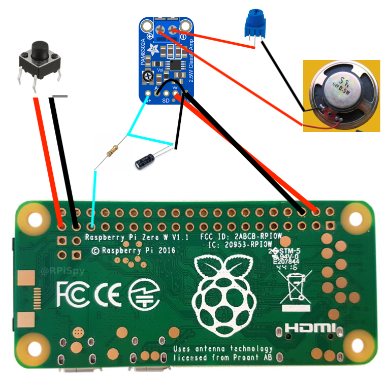

# Raspberry-Pi-TV (Mini DIY Build)

> **Idea in one sentence:**  
> A pocket-size TV powered by a Raspberry Pi Zero W, a 2.8″ DPI display and a PAM8302A amplifier, with hardware buttons for screen and audio control.
> The project is based on an idea by Brandon Withrow (Simpsons TV), but augmented with a PAM8302A amplifier and passive RC filter for “decent” sound.


References:
- Brandon Withrow Simpsons-TV guide (Waveshare) — https://withrow.io/simpsons-tv-build-guide-waveshare
- MiniTV project with revised schematics — https://github.com/SaifSabban/MiniTV
- Video Looper home page — https://videolooper.de/
- Tutorial “Video Looper on Pi Zero/W” — https://bavatuesdays.com/raspberry-pi-video-looper-on-zero-pi-w/
- PAM8302A Datasheet — https://cdn-shop.adafruit.com/datasheets/PAM8302A.pdf
- Passive low-pass filter for Pi Zero — https://www.instructables.com/Passive-Low-Pass-Filter-for-Audio-Circuits-Free-Fo/
- Adafruit: Adding basic audio output to Pi Zero — https://learn.adafruit.com/adding-basic-audio-ouput-to-raspberry-pi-zero
- Medium: Running UDA1334A I²S DAC on Pi Zero — https://yedianyang.medium.com/running-uda1334a-i2s-audio-interface-on-raspberry-pi-cf3aed300d6f
- Adafruit I²S Stereo Decoder wiring — https://learn.adafruit.com/adafruit-i2s-stereo-decoder-uda1334a/raspberry-pi-wiring
- TubeSync (bulk YouTube downloader) — https://github.com/meeb/tubesync
- FFmpeg - https://github.com/FFmpeg/FFmpeg

---

## Wiring Diagram



*Red = 5 V / audio +,  
Black = GND / audio –,  
Cyan = GPIO control (GPIO 19 → PWM audio, GPIO 26 → power button, GPIO 18 → AMP SD).*

---

## Bill of Materials

| Qty | Part | Notes |
|----:|------|-------|
| 1 | **Raspberry Pi Zero W v1.1** | GPIO header soldered |
| 1 | **2.8″ Waveshare DPI display (640 × 480)** | Any model with `waveshare-28dpi-*` overlay |
| 1 | **Adafruit PAM8302A Class-D amplifier** | 2.5 W @ 4 Ω |
| 1 | **Speaker 4 Ω / 3-5 W** | The better the speaker, the cleaner the sound |
| 1 | **RC low-pass filter** | **R = 270 Ω**, **C = 33 nF** → fc ≈ 18 kHz |
| 1 | **Push-button** | Pulls GPIO 26 to GND |
| 1 | **Potentiometer 1 kΩ** | Volume control on AMP input |
| — | 3D-printed case from Brandon Withrow’s guide | 6 perimeters for rigidity 

---

## Enclosure Printing

1. Print all STL files from the original Simpsons-TV guide.  
2. Use **6 perimeters / walls** for extra strength.  
3. Check button clearances; if they stick, chamfer edges or enable “thin walls” in your slicer for the case.  
4. Mount the display, Pi Zero W and speaker **before** final assembly.

---

## Wiring & Soldering

1. Solder the RC filter **in series** between **GPIO 19** (PWM audio) and `AIN+` of the amplifier.  
   *Use a ceramic capacitor to avoid polarity issues; electrolytic works if oriented correctly.*  
2. Connect `AIN–` to GND.  
3. Power the PAM8302A from the Pi’s 5 V rail and GND.  
4. Tie the **SD** pin of PAM8302A high (always enabled) or route it to a spare GPIO for mute.  
5. Wire the push-button between **GPIO 26** and GND.

---

## Software Setup

### 1. Flash the Video Looper Image

* Download the **Video Looper** image for Pi Zero.  
* Flash to micro-SD and boot.

### 2. `config.txt` Tweaks

Append the following to `/boot/config.txt`:

```
# enable pwm on GPIO 19
dtparam=audio=on
dtoverlay=pwm,pin=19,func=4,enable_jack

# display settings
gpio=0-9=a2
gpio=12-17=a2
gpio=20-25=a2
dtoverlay=dpi24
enable_dpi_lcd=1
display_default_lcd=1
extra_transpose_buffer=2
dpi_group=2
dpi_mode=87
dpi_output_format=0x7F216
hdmi_timings=480 0 26 16 10 640 0 25 10 15 0 0 0 60 0 32000000 1
dtoverlay=waveshare-28dpi-3b-4b
dtoverlay=waveshare-28dpi-3b
dtoverlay=waveshare-28dpi-4b

# rotate display for 270 degrees, so it is more convenient to install it in the case, otherwise you will see the black edge of the screen

display_rotate=3
```

### 3. Screen/Audio Control Script and systemd service

1. Copy the code from buttons.py, which will be used to control the power button, to `/home/pi/buttons.py`
2. Create and run the `tvbutton.service`, which will be used to autorun the button control:
	* `sudo nano /etc/systemd/system/tvbutton.service`
	* copy code from the repository service `tvbutton.service`
	* activate the service - `sudo systemctl enable tvbutton.service`.

### 4. Prepare and upload video to Raspberry

1. Expand SD card with `raspi-config`

2. Edit `/boot/video_looper.ini` uncommenting option to play videos from the SD card

3. Video Looper expects videos on in the /home/pi/video directory in .mp4 format, so just put them inside any way you like. You will seal the enclosure, so this can only be conveniently done over the network anyway, for example via scp:
	* `scp "/Users/user/tubesync-downloads/video/tw "*.mp4 pi@192.168.1.114:/home/pi/video/` where
    	* `/Users/user/tubesync-downloads/video/tw "*.mp4` - all .mp4 files in the tw directory
    	* `pi@192.168.1.114` - user and IP address of Raspberry

4. Tubesync - https://github.com/meeb/tubesync - is convenient for mass uploading Youtube videos.

	* Tubesync downloads videos not in mp4, so you will need to convert them via ffmpeg, for example, for all .mkv files in the directory - `for f in *.mkv; do ffmpeg -i "$f" -c copy "${f%.mkv}.mp4"; done`
	* As soon as the TV sees the new videos - it will start playing them. Refer to the Video Looper documentation to configure the playback settings


